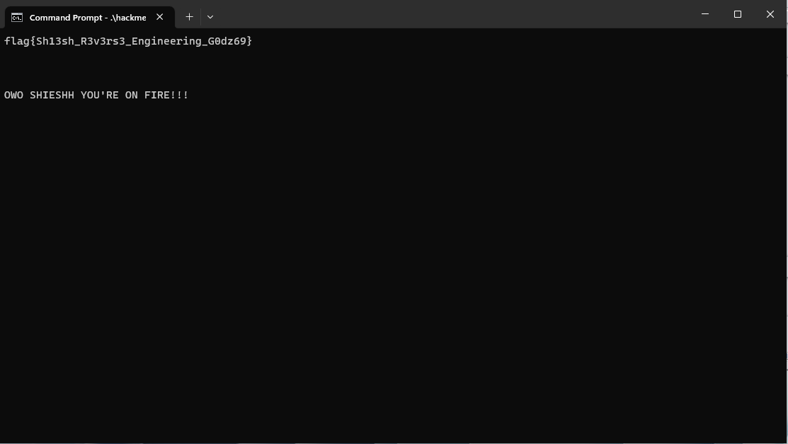

# Hackme_Level_9000 by Ph_Fox

You can download the file [here](https://crackmes.one/crackme/63c34e6833c5d43ab4ecf45b)

The goal of this crackme is to obtain the flag by completing all 9000 levels; However, nobody has time for that so, lets crack through it.

When opening the executable with Ghidra, it will show the variables responsible for the levels in the main function.

Applying binary patching will modify the starting level to anything we want. We'll put it to level 8999.

A new version of this program can be made by using the export feature from Ghidra. After exporting as a binary file, it can be executed in the terminal.

You can see that the program has started at level 8999 now. Only 2 solutions will be needed to obtain the flag.

