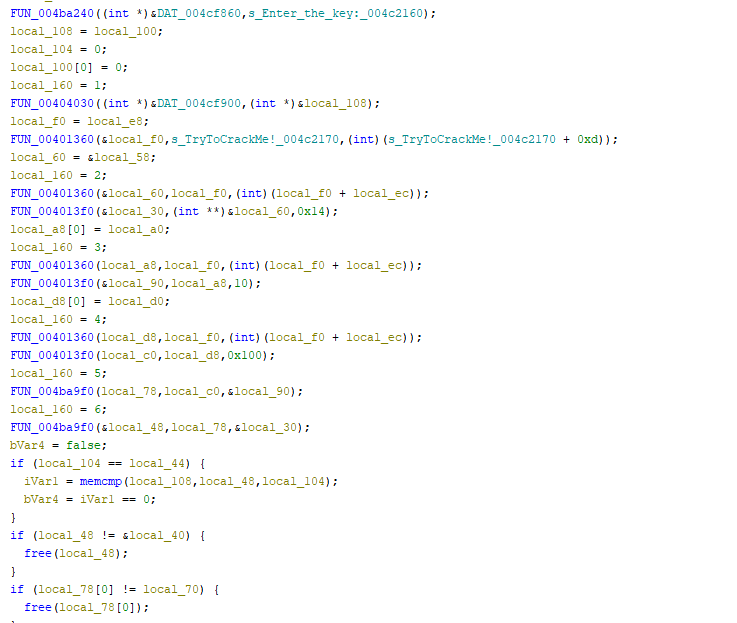

# Calculator by hoangnguyen

You can download this file [here](https://crackmes.one/crackme/64d39fafb25df8732eebc658)

The first thing that needs to be known is that this file is packed. When opening with a debugger or IDA Pro, it will say that its analysis is inaccurate. Using Detect It Easy to analyze the file will show that the file is protected with ASMGuard.


Since there are no tools to unpack this, it'll have to be done manually. 

What I have done is downloaded ASMGuard and created my own program that simply prints ``Hello World``.

```
#include <stdio.h>
#include <stdlib.h>

int main(){
    printf("Hello World!");
}
```

Running our program through ASMGuard will lead to 2 different files, a protected file and the original file. Opening both files in Detect It Easy will show that our program has definitely been packed similarly as the crackme. 


Notice the entry point in the original is ``004012e0``. This will play a big role very soon.

When opening the crackme and our protected program in IDA, it'll show that the code flow is exactly the same.


This would indicate the loop is fake. There should be something that doesn't follow the loop. Usually, it's something with a single flow.

Following the only path that doesn't end in a loop on our program, it will show a jump instruction to an address that looks very, ``jmp  near ptr 4012E0``. This is the entry point for our program before packing. Viewing the IDA that is analyzing the crackme should show a different address, ``401280``. The file has been found.

Using a debugger will allow you to set a breakpoint at the base address + offset. IDA will usually set the base address as 0x400000. The address for the instruction is at 0x5CA433. It will be 0x400000 + 0x1CA4333


Stepping over once at this address will lead to the unpacked code. The code can be analyzed starting here using a debugger or be dumped to disk. In my case, I used Scylla to dump from memory and reallign the offsets.


Now that the file is unpacked, it should be possible to search for strings. Opening the program will show the string "Enter the key:". This will be what to search for since the logic will most likely be near it.



Next, the conditionals should be checked to see if they are related to the key. Analyzing them will show that the following conditional is involved with the key:

    if(local 104 == local_40)

Checking the assembly instruction to this will lead to:

    CMP EAX, dword ptr [EBP+local_40]

Let's have a look at the state of the program while its running in a debugger.


You may notice that the value of EAX is actually the length of the user input. In this case, I have entered "iwashere" which is 8 characters. The value of where the key is held is 0x27. This must mean that the key is 39 characters long. It just so happens that one of the visible strings that look like a key is 39 characters and turns out to being the key. 


