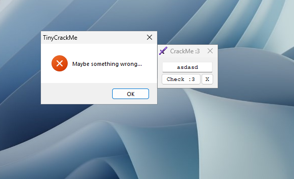
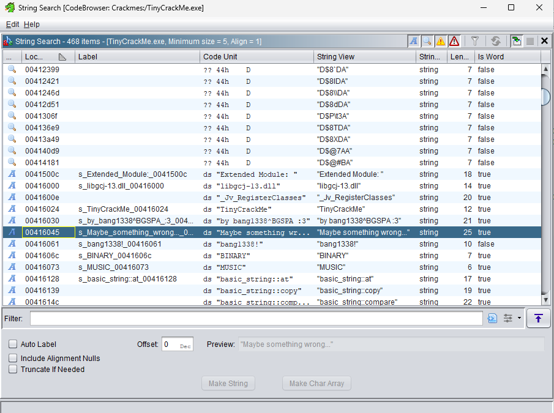
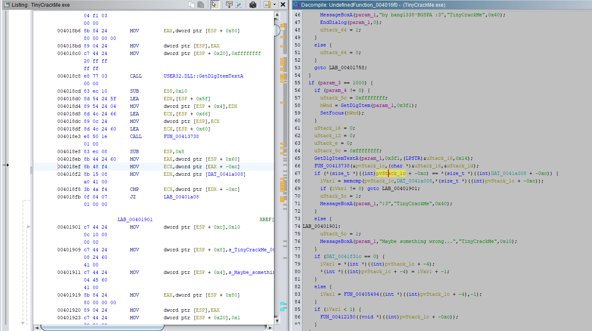
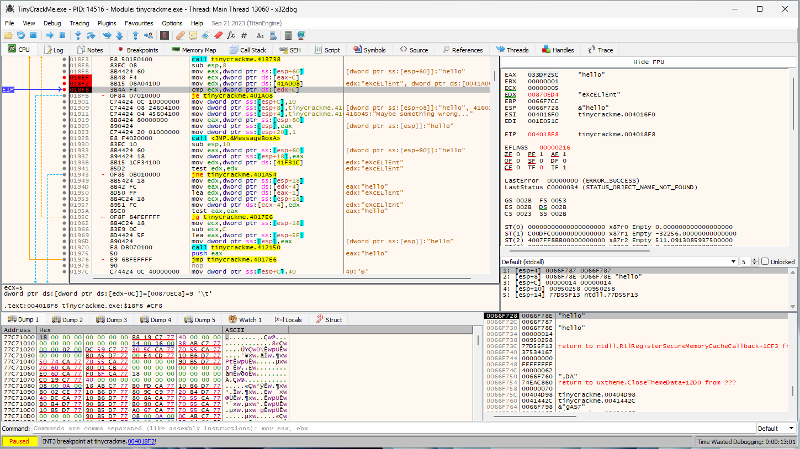
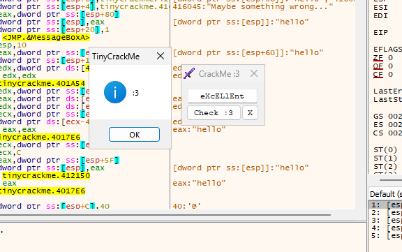

# TinyCrackMe by Bang1338

You can download the file [here](https://crackmes.one/crackme/64d4f2b1b25df8732eebc6d0).

When first running the program, it shows some strings that can be checked for that may be close to the password checking mechanism.

Using Ghidra to search for strings or ``strings`` command in the terminal can show the strings in the program.

Ghidra will show where the string is stored. Using a crossreferencing can lead to the main function.

Analyzing the function will show that the mechanism to checking the password is in the main function. However, it's difficult to follow the through with it.

Taking a look at the assembly code, it shows that the password is stored in EDX and the string we entered is stored in ECX. Let's open up a debugger to check out what is stored in ECX.

After searching for the same instruction sequence and setting breakpoints, it shows that "eXcELlEnt" is stored in EDX. This should be the password. Lets try it out.

