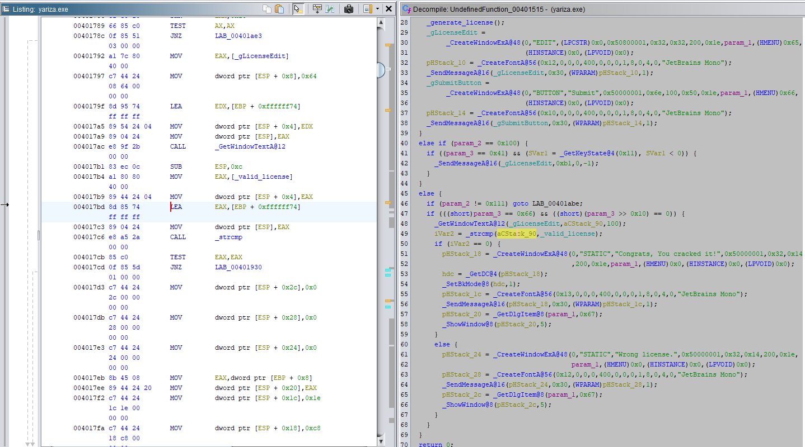
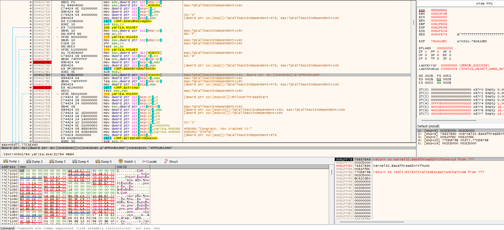
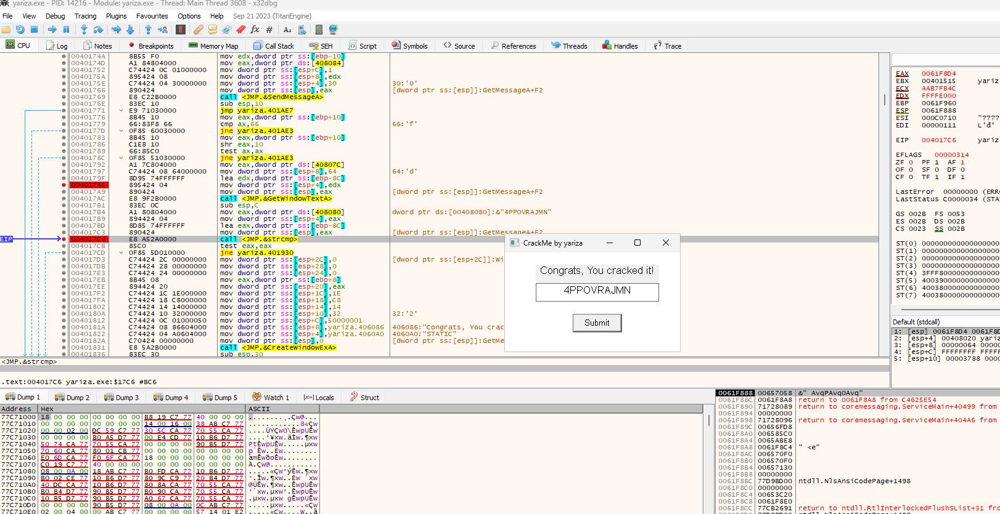

# Crackme by Yariza

You can download this file [here](https://crackmes.one/crackme/64289ceb33c5d43938912378)

Testing the program first to look observer the UI will lead to finding the string "Wrong License". This string can be searched and followed to find the where the main mechanism will be. Clicking on the conditional statement should show the assembly instructions in the listing window. The instruction should be:

    LEA EAX, [EBP + 0xffffff74]

Attaching the program to a debugger and searching the command will lead to an area where the license is generated. Stepping through the program a bit, it will show that the license is generated before the user input. 

This string is the license because it is the value being compared to the user input. This can be checked by stepping through the instructions and seeing for yourself. 

The user can copy and paste the license in before submitting.

Do note that everytime the program is ran, the license will change.

