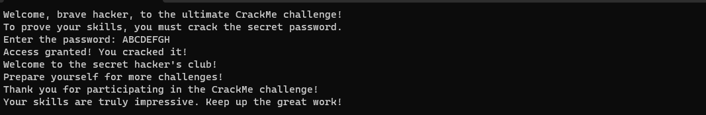

# Lizz by Lucas0001

You can download this crackme [here](https://crackmes.one/crackme/64a06bac33c5d460c17f1f59).

Using Ghidra, it is possible to see the decompiled code that was used to create this program. Tracing through the functions in the program, it will eventually lead to the main function which shows the checking mechanism.

Inspecting the code will lead to the conclusion that the password should:

    1. Be 8 characters long
    2. Start with "A" (0x41)
    3. A sequential string of characters

This means the password should be ``ABCDEFGH``.

