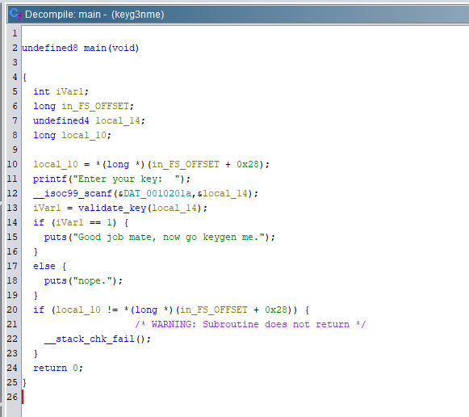
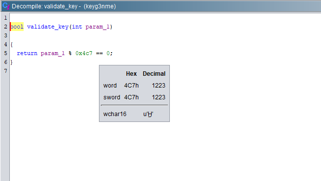
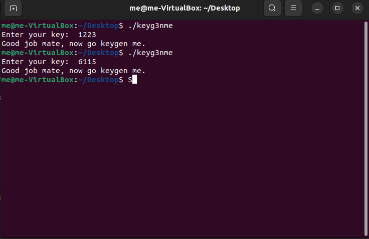

# K3ygenme

Starting off with Ghidra, the main function can be found in the function folder.

Notice that there is a ``validate_key`` function. It will probably lead to solving the crackme. Navigating to the function with the decompiler shows some logic.

It looks like as long as the password is divisble by 1223 then it will work.

