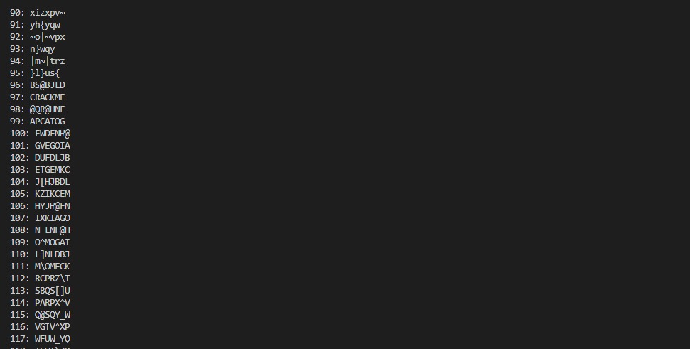
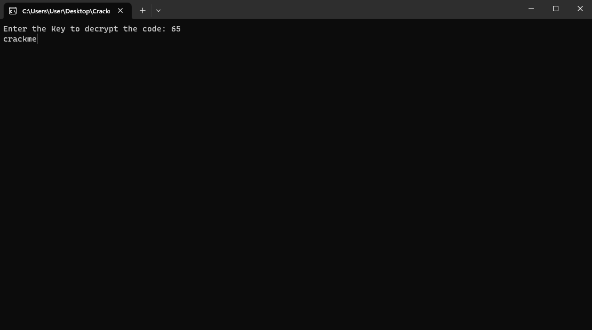

# BabyCrackme by 2sourc3

You can download this file [here](https://crackmes.one/crackme/63ab1e9333c5d43ab4ecf14c).

This crackme requires a way to decipher the coded text. Opening the file in Ghidra and navigating to the main function will show the coded text.


It also shows that the encyption algorithm is a byte xor'd with a char (or char ^ char since they are both the size of a byte). A byte only has 256 combinations therefore meaning this crackme should be able to be brute forced. 

A program will be needed to brute force the solution. Here is my version:

```
#include <stdio.h>
#include <stdlib.h>
#include <string.h>

int main(int argc, char *argv){
    
    //initialize char array
    char *key = (char *) calloc(6, sizeof(char));
    strcpy(key, "\"3 \"*,$");

    //loop for 256 combinations
    for(int i = 0; i <= 256; i++){
        printf("%i: ", i);
       for(int j = 0 ; j < (int) strlen(key); j++){
            char c = *(key + j);
            char val = i ^ c;
            printf("%c", val);
       }

       printf("\n");
    }

    free(key);
}
```

Running the program will print out a list of garbage. Analzying the garbage will actually show 2 possible solutions to the challenge. 65 and 97.




The text for 65 is ``crackme`` and the one for 97 is ``CRACKME`` making them viable solutions. 

When entering the keys, the program will close too quickly to see anything. It needs to be attached to a debugger to be visible. The XOR expression found in Ghidra can be used as a search point in a debugger; Afterwords, a breakpoint can be set. Everytime the program runs until return, it should display one character at a time now. After testing 65 and 97, the program should display the answers and immediately close.


