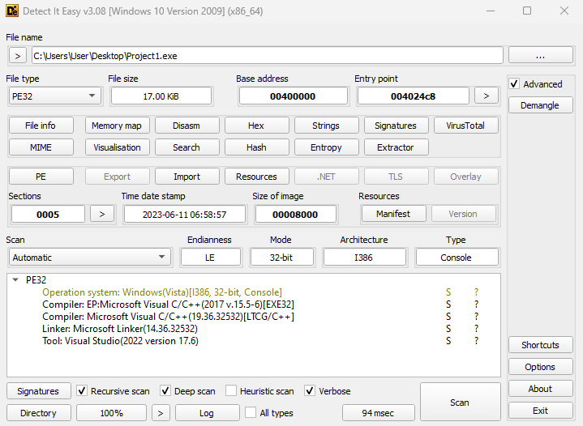
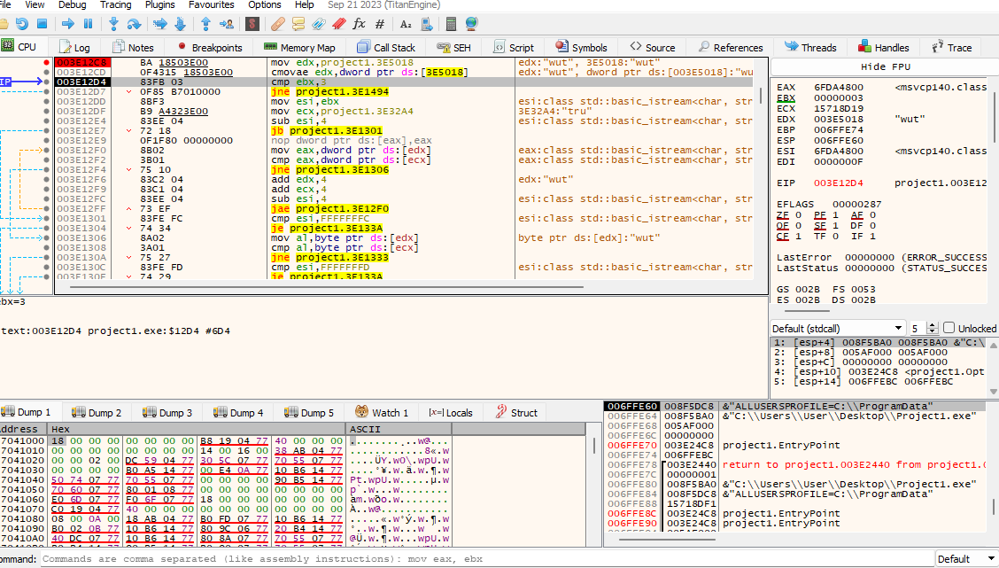

# Crackme#1 by filenort

You can download the file [here](https://crackmes.one/crackme/6485d56733c5d439389137eb)

This first thing to do after running the program once is to check whether this file is packed. This can be done with Detect It Easy. It will show that it is not. 



Next, lets analyze it with Ghidra. The string should be visible since it is not packed. Looking for the strings that were shown when running the program and crossreferencing will lead to the main function.

```

/* WARNING: Removing unreachable block (ram,0x004012f0) */
/* WARNING: Removing unreachable block (ram,0x004012f6) */
/* WARNING: Removing unreachable block (ram,0x0040132b) */
/* WARNING: Globals starting with '_' overlap smaller symbols at the same address */

undefined4 FUN_004011d0(void)

{
  undefined4 *_Src;
  byte bVar1;
  basic_ostream<> *this;
  uint uVar2;
  int **ppiVar3;
  int **ppiVar4;
  undefined4 **ppuVar5;
  size_t _Size;
  bool bVar6;
  code *pcVar7;
  
  pcVar7 = FUN_004017f0;
  this = (basic_ostream<> *)FUN_004015d0((int *)cout_exref,"Hello.");
  std::basic_ostream<>::operator<<(this,pcVar7);
  FUN_004015d0((int *)cout_exref,"Input Username: ");
  pcVar7 = cin_exref;
  bVar1 = std::basic_ios<>::widen((basic_ios<> *)(cin_exref + *(int *)(*(int *)cin_exref + 4)),'\n')
  ;
  FUN_00401bd0((int *)pcVar7,&DAT_00405030,bVar1);
  while (_DAT_00405040 == 0) {
    FUN_004015d0((int *)cout_exref,"\nPlease enter your Username: ");
    pcVar7 = cin_exref;
    bVar1 = std::basic_ios<>::widen
                      ((basic_ios<> *)(cin_exref + *(int *)(*(int *)cin_exref + 4)),'\n');
    FUN_00401bd0((int *)pcVar7,&DAT_00405030,bVar1);
  }
  FUN_004015d0((int *)cout_exref,"Input Password: ");
  pcVar7 = cin_exref;
  bVar1 = std::basic_ios<>::widen((basic_ios<> *)(cin_exref + *(int *)(*(int *)cin_exref + 4)),'\n')
  ;
  FUN_00401bd0((int *)pcVar7,&DAT_00405018,bVar1);
  ppiVar3 = &DAT_00405018;
  if (0xf < DAT_0040502c) {
    ppiVar3 = (int **)DAT_00405018;
  }
  if (DAT_00405028 != 3) {
LAB_00401494:
    FUN_00401820((int *)cout_exref,&DAT_00405440);
    Sleep(2000);
                    /* WARNING: Subroutine does not return */
    exit(-1);
  }
  bVar6 = *(byte *)ppiVar3 < 0x74;
  if (((*(byte *)ppiVar3 == 0x74) &&
      (bVar6 = *(byte *)((int)ppiVar3 + 1) < 0x72, *(byte *)((int)ppiVar3 + 1) == 0x72)) &&
     (bVar6 = *(byte *)((int)ppiVar3 + 2) < 0x75, *(byte *)((int)ppiVar3 + 2) == 0x75)) {
    uVar2 = 0;
  }
  else {
    uVar2 = -(uint)bVar6 | 1;
  }
  if (uVar2 != 0) goto LAB_00401494;
  if (DAT_0040502c == 3) {
    FUN_00401980(1);
  }
  else {
    DAT_00405028 = 4;
    ppiVar3 = &DAT_00405018;
    if (0xf < DAT_0040502c) {
      ppiVar3 = (int **)DAT_00405018;
    }
    _Src = (undefined4 *)((int)ppiVar3 + 3);
    if ((&DAT_004032a8 < _Src) || ((undefined4 *)((int)ppiVar3 + 3) < &DAT_004032a8)) {
      _Size = 1;
    }
    else if (&DAT_004032a8 < _Src) {
      _Size = (int)ppiVar3 - 0x4032a5;
    }
    else {
      _Size = 0;
    }
    memmove(ppiVar3 + 1,_Src,1);
    memcpy(_Src,&DAT_004032a8,_Size);
    memcpy((void *)(_Size + (int)_Src),(void *)((int)&DAT_004032a8 + _Size + 1),1 - _Size);
  }
  ppiVar3 = &DAT_00405018;
  if (0xf < DAT_0040502c) {
    ppiVar3 = (int **)DAT_00405018;
  }
  if (DAT_00405028 != 4) {
    return 0;
  }
  ppiVar4 = (int **)&DAT_004031f8;
  uVar2 = 0;
  do {
    if (*ppiVar3 != *ppiVar4) goto LAB_0040142a;
    ppiVar3 = ppiVar3 + 1;
    ppiVar4 = ppiVar4 + 1;
    bVar6 = 3 < uVar2;
    uVar2 = uVar2 - 4;
  } while (bVar6);
  if (uVar2 != 0xfffffffc) {
LAB_0040142a:
    bVar6 = *(byte *)ppiVar3 < *(byte *)ppiVar4;
    if ((*(byte *)ppiVar3 != *(byte *)ppiVar4) ||
       ((uVar2 != 0xfffffffd &&
        ((bVar6 = *(byte *)((int)ppiVar3 + 1) < *(byte *)((int)ppiVar4 + 1),
         *(byte *)((int)ppiVar3 + 1) != *(byte *)((int)ppiVar4 + 1) ||
         ((uVar2 != 0xfffffffe &&
          ((bVar6 = *(byte *)((int)ppiVar3 + 2) < *(byte *)((int)ppiVar4 + 2),
           *(byte *)((int)ppiVar3 + 2) != *(byte *)((int)ppiVar4 + 2) ||
           ((uVar2 != 0xffffffff &&
            (bVar6 = *(byte *)((int)ppiVar3 + 3) < *(byte *)((int)ppiVar4 + 3),
            *(byte *)((int)ppiVar3 + 3) != *(byte *)((int)ppiVar4 + 3))))))))))))) {
      uVar2 = -(uint)bVar6 | 1;
      goto LAB_00401460;
    }
  }
  uVar2 = 0;
LAB_00401460:
  if (uVar2 == 0) {
    ppuVar5 = &DAT_00405428;
    if (0xf < DAT_0040543c) {
      ppuVar5 = (undefined4 **)DAT_00405428;
    }
    FUN_00401d80((int *)cout_exref,(char *)ppuVar5,DAT_00405438);
  }
  return 0;
}

```

You'll notice a lot of conditionals but don't let it overwhelm you. When entering the wrong information in the program, you'll notice a delay before the program closes. One of the conditionals has a ``sleep()`` before exiting out. This may be it. We should take a look at it under a debugger. We're looking for the instruction:

    CMP EBX, 3



It looks like the condition is checking the length of our password. If you previously stepped through this program, you'll notice that the username is not checked. Only the password matter. Going further you may notice that it is comparing your password with specific characters. This will be the password. A 3 lettered word.