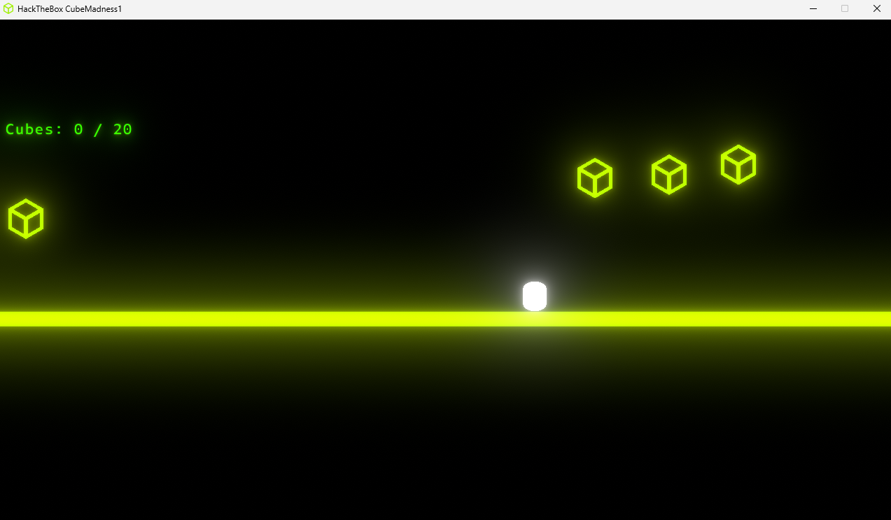
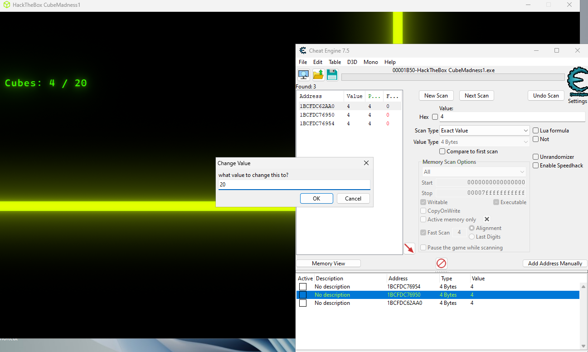

# Game Madness 1

This challenge can be solved by using basic Cheat Engine(CE) skills. When booting the game up, a score UI and other assets will load up.

You can attach CE onto the game process and scan for the score value. Grab a box after scanning and the score will update to a new value. Scanning for this new value will help CE narrow down to the memory address for the score value. Continue doing this until you can see the address responsible for storing the score and update the value to 19 or 20 to show the flag.

