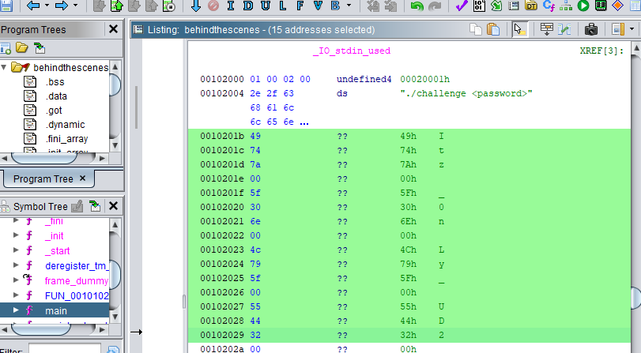

# Behind The Scenes

Search for strings will give HTB{%s} meaning there is a command that puts that string in.

Analyzing the file with Ghidra and looking around the area where the string is stored will show the flag.

