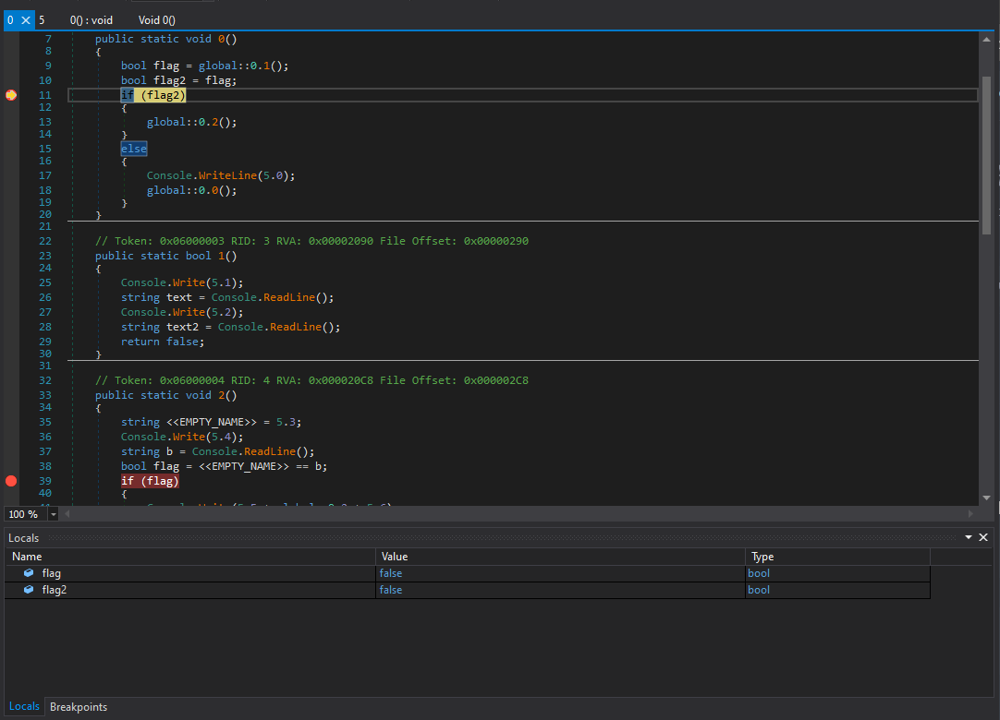
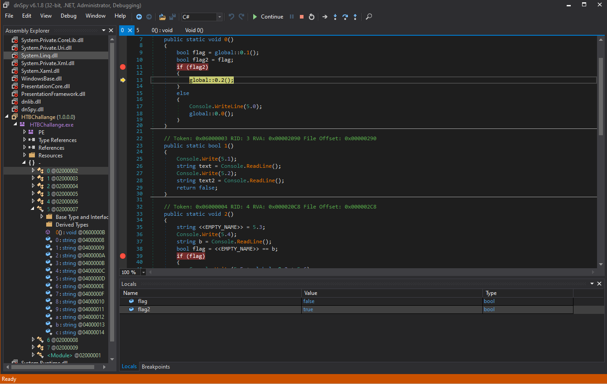
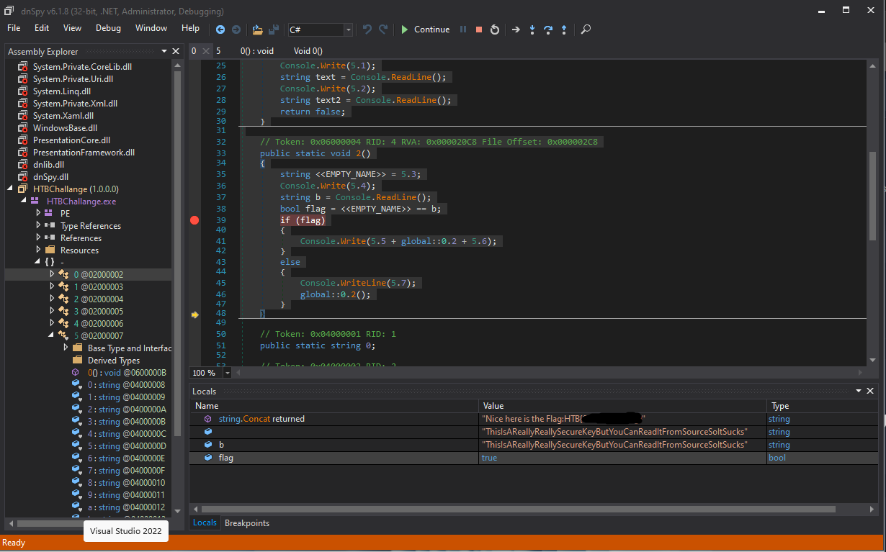

# Bypass

Opening this program with Detect It Easy will give information that this program uses .NET library. It can be assumed that the program is coded in C#. There is a great disassembler to use for C# code called ``dnSpy``.

The dnSpy debugger can be used to step through the program. While stepping through, it can stop at an certain line of code and change its datato fit what is needed. This means that it can redirect code such as bypassing conditionals by changing the value of the statement to what you want. It can also change the value of a string at the time of comparison.

This program needs to stop right after entering the username, password, and secret key. 2 Breakpoints were set to do this.
In this case, I have changed all the conditionals to be true. This leads to the program assuming I have entered all the correct passwords and keys.

The value of the flags can be seen in the ``Locals`` window. Clicking on the value will allow editing.

Flag2 has been changed from false to true. Stepping into the program one more time leads to it assuming the value of the expression is ``true``.

Doing the same for the other conditional, it will end up showing the flag.

