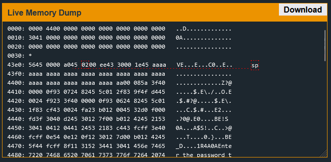
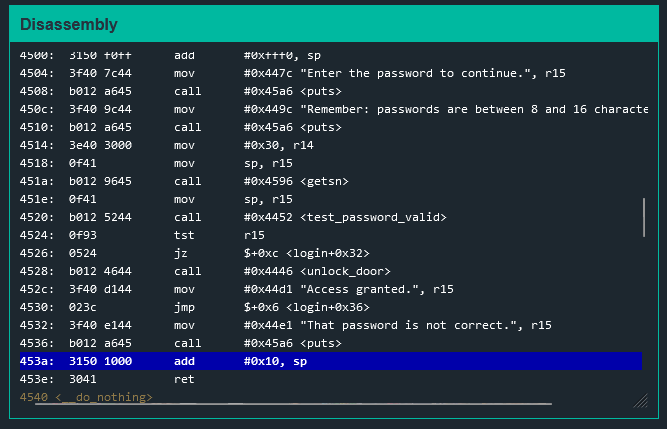
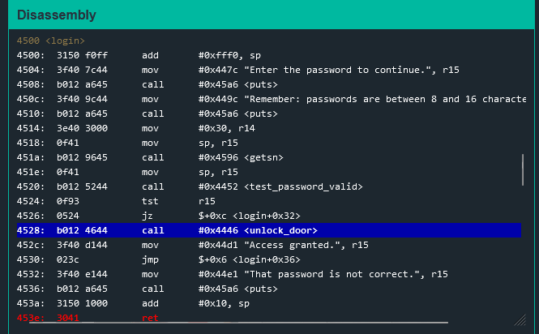
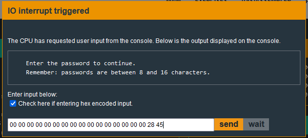
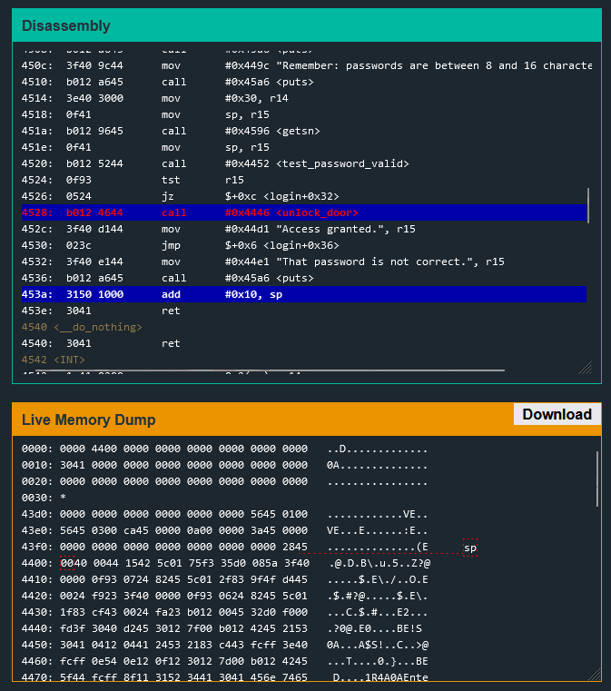

# Cusco

In this challenge, I tested whether the buffer is checked first.

We can see that the buffer is not checked.

Analyzing the ``login`` function will show that it adds 0x10 to the stack pointer near the end of execution. This means that the next instruction it will execute is at 0x43ee + 0x10.

With the buffer unchecked, we can place a value into that address which is 0x43fe. This also means we can just place any instruction in there. In this case, we can put the pointer to where it calls the ``unlock_door`` function. In my case, the function call is at 0x4528.

Lets test the theory of putting the instruction address at 0x43fe.

The system follows little endian.

We can see here that after stepping through, it will jump to the call.

The solution to this challenge is a basic buffer overflow.