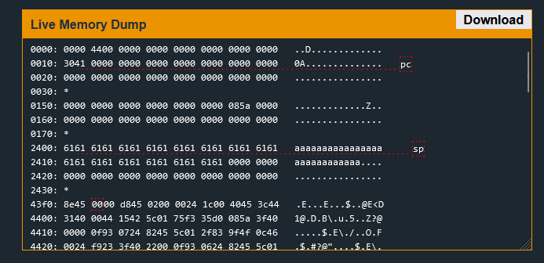
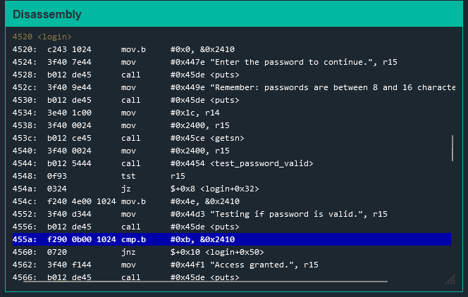
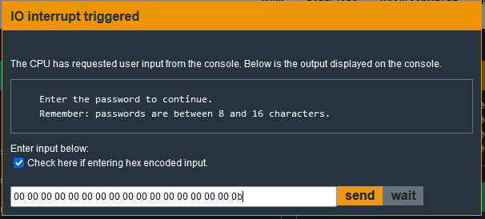

# Hanoi

Starting off, I checked to see the limitations of entering the password.

Starting at address 0x2400, we can see that I entered way more than 16 characters and it stored all of it. 

If we take a look at the ``login`` function, we'll see something interesting.

We can see that the password check only checks for 0xb at address 0x2410. Since the buffer is unchecked, we can reach that address by giving a long enough password that reaches there. This means that as long as the 17th byte is 0xb it will work.

This is an example of a solution.