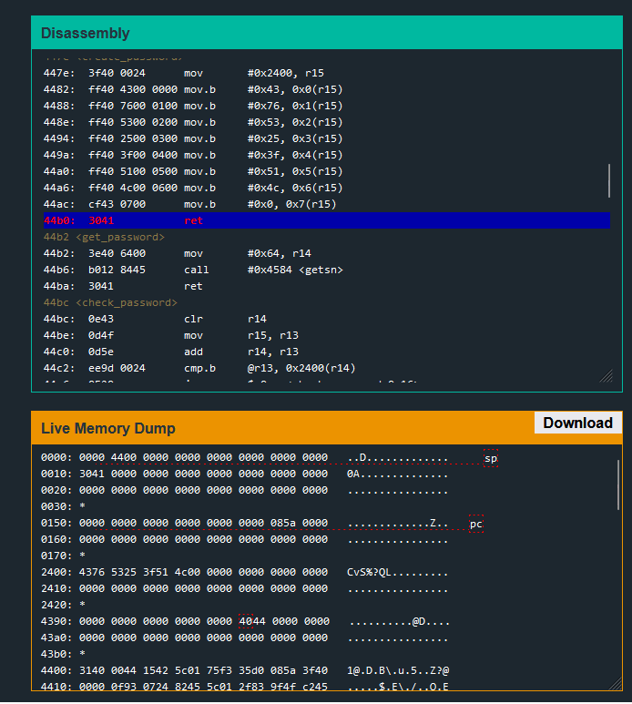

# New Orleans

When looking through the comments in the dissassembler, you will notice a `create_password` function. Reading the instructions, we can see it is placing fixed values into r15 + offset. As you step through the program and look at the address where values are being moved through the live memory dump, you will see the password being generated in plain text. It is CvS%?QL.