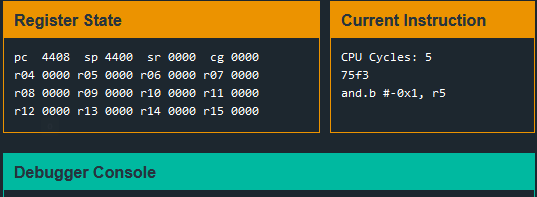
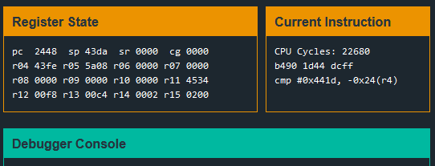

# Reykjavik

In this challenge, the password checking mechanism is encrypted. Luckily, we can see the instructions in the ``Current Instructions`` box.

Intuitively, we should think the password checking mechanism needs to compare 2 passwords. With this in mind, we can seek only for CMP instructions while stepping through the program. 

The instruction implies that the password is 0x441d at the offset of -0x24. This means we can put the password in first and then put in enough bytes so that -0x24 will point back to the password.