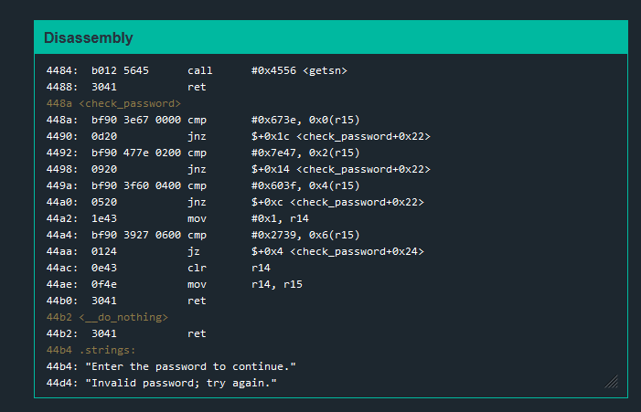

# Sydney

In this one, we dont have a `create_password`. Something you can do is to see how they use `check_password`. If we decipher what it is comparing then it might be the password. The program works in little endian. What we are checking for is **3e67477e3f603927** to ASCII. Using a hex to ascii generator, it should come out as **>gG~?`9'**.