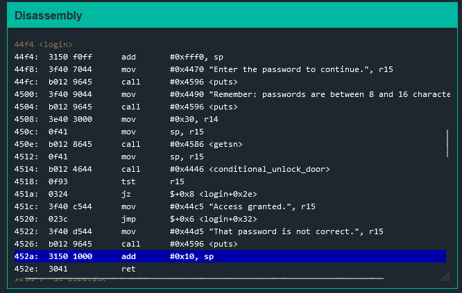
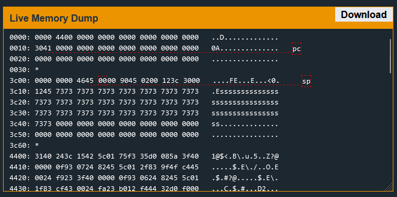
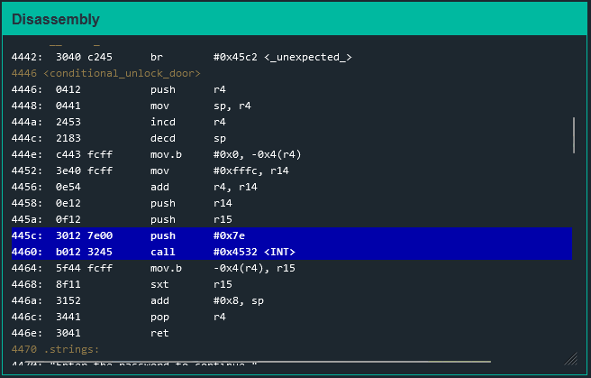
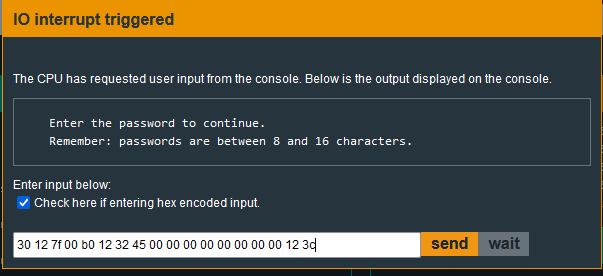

# Whitehorse

Analyzing the ``login function`` first, we can see that there is an ``add 0x10`` instruction near the end of execution.

Lets check to see if it can be taken advantage of by exploiting the buffer.

The password seems to be stored at 0x3c12. It looks like a buffer overflow can be done to exploit the login function.  What would we point that exploit to though? Since there is no syscall, we will have to make our own. This challenge is about basic code injection.

In order to tell them computer to do something, we need an interrupt. However, every interrupt needs a vector. In order to figure out the vector, I looked at the manual for the hardware it is attached to, the LockIT PRO HSM-2.

Lets find some machine code that we can modify and use this vector.

In this case, the machine code 0x7e in 0x445c probably represents the push. Lets change that to be 0x7f. It will end up being ``3012 7f00``. Now lets put all of this machine code to be our password. The password will be: ``30 12 7f 00 b0 12 32 45``. Since the password is not long enough, it will need to be padded for the exploit. It can then point back to where our password is stored to run the machine code. The end result will be:

The machine follows little endian so, our instruction address will be backwards.

Once again, this challenge is an example of a basic code injection. 

