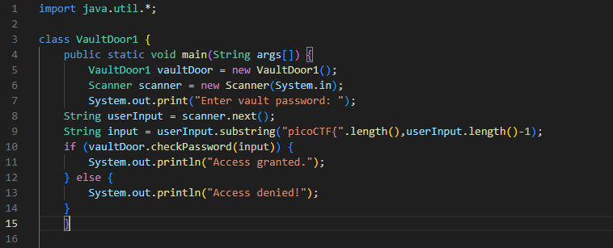
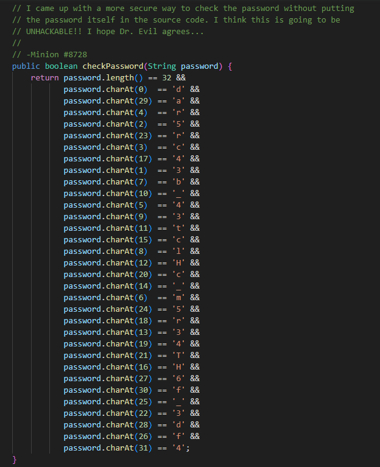
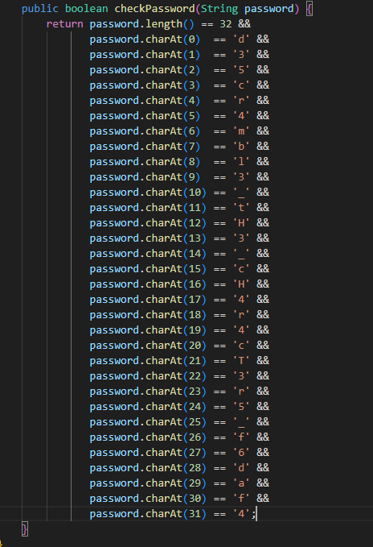
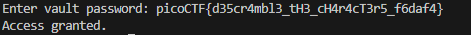

# Vault Door 1
This is a continuation of the Vault Door challenges.  
In this challenge we can see that the base code is the same as the previous vault code challenges but the checkPassword algorithm has changed. Let's take a look at the new algorithm.

## Base Code

## checkPassword

It looks like the new password should be 32 characters in length and it is checking for specific characters at a specific index. So, `charAt(0) == 'd'` would mean that the first letter of the password must be a "d". If that's the case the lets reorganize it.It should look like:
## checkPassword Organized

Now we can just read straight down to see that the password is 
d35cr4mbl3_tH3_cH4r4cT3r5_f6daf4. Since the base code is the same, we need to submit it in the same format as last time which is `picoCTF{}`. The password should be 
picoCTF{d35cr4mbl3_tH3_cH4r4cT3r5_f6daf4}. Let's give it a try. 

Success!