# Vault Door 3

This is a continuation of the Vault Door Challenges.  

It looks like the checkPassword Algorithm has changed once again and the base code is still the same. Let's take a look at it. 

### Base Code
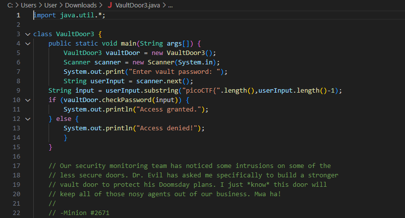
### checkPassword
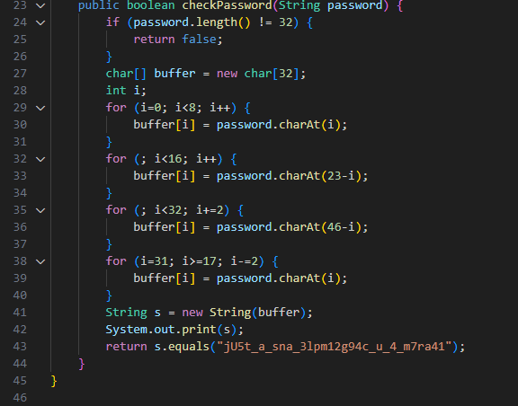
 
It looks like these minions are now using loops to generate a password and the password should be **jU5t_a_sna_3lpm12g94c_u_4_m7ra41** when it passes through all the loops. This would mean that the password must contain these characters since the only method being used is `charAt()`. If we reverse the process that generated this string, then we should get the password. Let's break down the function and its loops to see what it is doing to generate the password.

### Lines 23 - 27
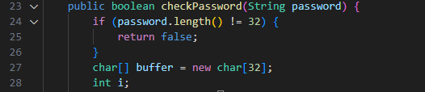
 
This tells us that the password must be exactly 32 characters in length that is stored in an array. This means our starting point would look like this using an excel sheet to represent our array:

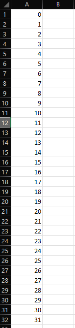

### Lines 29 - 31
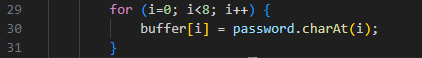
 
Since we are reversing **jU5t_a_sna_3lpm12g94c_u_4_m7ra41**, we will assume this is our input from here on out. We can see that 'i' starts at 0 and is being iterated up to 8 in increments of 1. This means that we access indexes 0,1,2,3,4,5,6,7 and save the same corresponding character at that index. For example, index 0 will save the character at index 0 from the string, index 1 will save the character at index 1 from the string, and all the way up to 8. Our array should look like:  
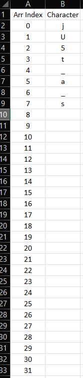

### Lines 32 - 34
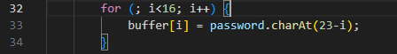
Once again we see 'i' being incremented by 1, but there is a twist. The character being checked is not the same as i. In fact, it looks like the character being checked is going in the reverse direction of 'i'. We can get the range by subtracting the min and max values from 23. In this case, it is 8 and 15. We know this because we left off with `i = 8` from the previous loop and this loop only goes up to 15. Therefore our range must be `23-15` to `23-8` which is 8 - 15 but remember we are looking at the string from right to left so, it is actually 15 to 8. For example, index 8 will store the character at 15, index 9 will store the character at 14, index 10 will store character at 13, and etc. This our array will look like:
 
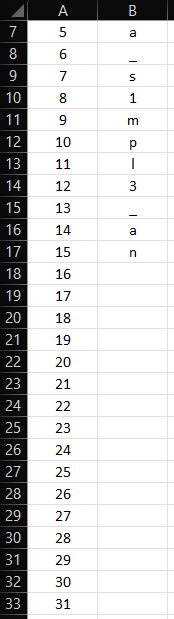

### Lines 35 - 37

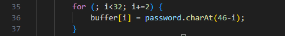

This time around we see that 'i' is incrementing by 2. Since 'i' is being used to access the buffer, it will also affect what index is storing values. This means that not only are only looking at even numbers from 16 - 30, but the indexes we save the characters will be only the even numbers from 16 - 30 (16,18,20,22,24,26,28,and 30). We can also see that it is being read in reverse like from the previous loop in lines 32 - 34 because of `password.charAt(46-i)`. Therefore, our array looks like:

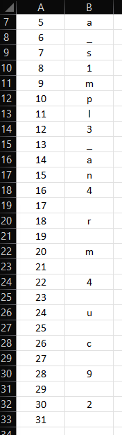

### Lines 38 - 40

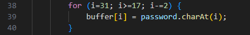
 
Finally, the last loop starts at the end and decrements by 2. However, if we keep subtracting by 2 on an odd number, we will always get an odd number. This means that this must be going over all of the odd numbers in reverse up to 17, or the rest of the characters that are left. In short, this uses the same process as the previous loop but, it covers the odd indexes. The array looks like this after iterating:

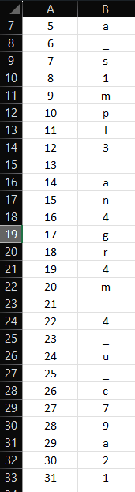
 
If we read from top to bottom, we can see that it spells **jU5t_a_s1mpl3_an4gr4m_4_u_c79a21**. Lets try it out with the format which it will be **picoCTF{jU5t_a_s1mpl3_an4gr4m_4_u_c79a21}**.

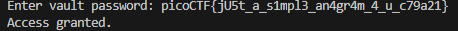
 
Success!