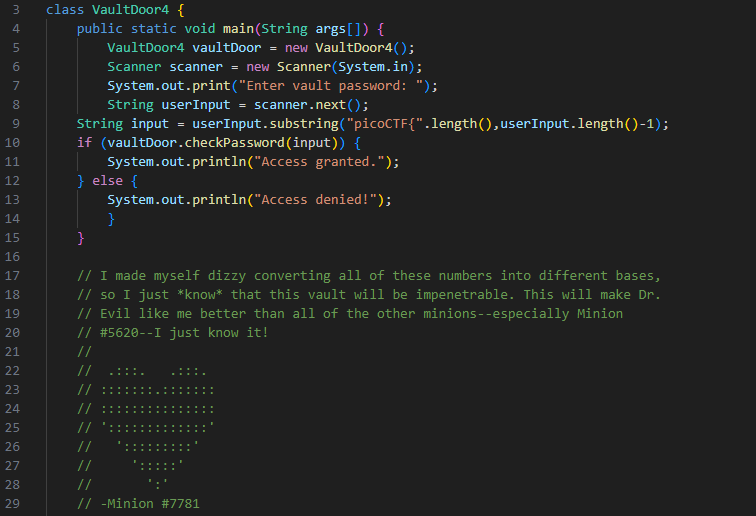
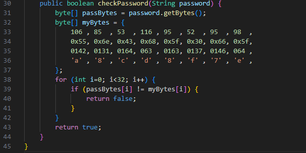
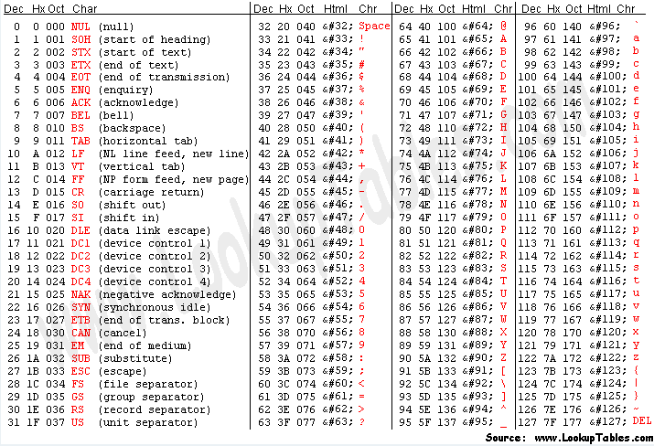
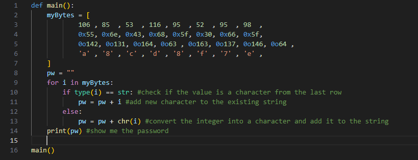
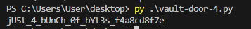
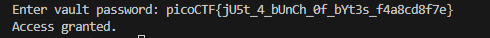

# Vault Door 4
*This is a continuation on the Vault Door Challenges.*  
Once again, the minions have changed the checkPassword algorithm. This time, it looks like they're using a new method to hide their password. Let's take a look at it.

### Base Code

### checkPassword

 
It looks like the minions have encoded their password using different bases. It seems like the first row is decimal, second is hexadecimal, third is octal, and the fourth row is not encoded. Lets look at an ASCII table to conver all the numbers into a string.

### Method 1: Matching values with an ASCII table

 
Here we can see all the decimal, hexadecimal, and octal values given for every ASCII character. If we compare the data with the table one by one, we get **jU5t_4_bUnCh_0f_bYt3s_f4a8cd8f7e**. However, there is a better way to solve this.

### Method 2: Decoding with a Python script

 
Using Python, I can automate this task with a few basic tricks. First, I have taken the data from source code and have iterated over every index. During each iteration, the value is converted to a character and appended to the string. At the end, the string will be shown in our terminal. Lets give it a run.

 
It looks like it worked! But is this even the solution? We should give it a try with the `picoCTF{}` like last time. The password will be **picoCTF{jU5t_4_bUnCh_0f_bYt3s_f4a8cd8f7e}**

Success!