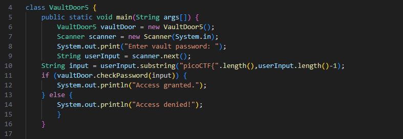
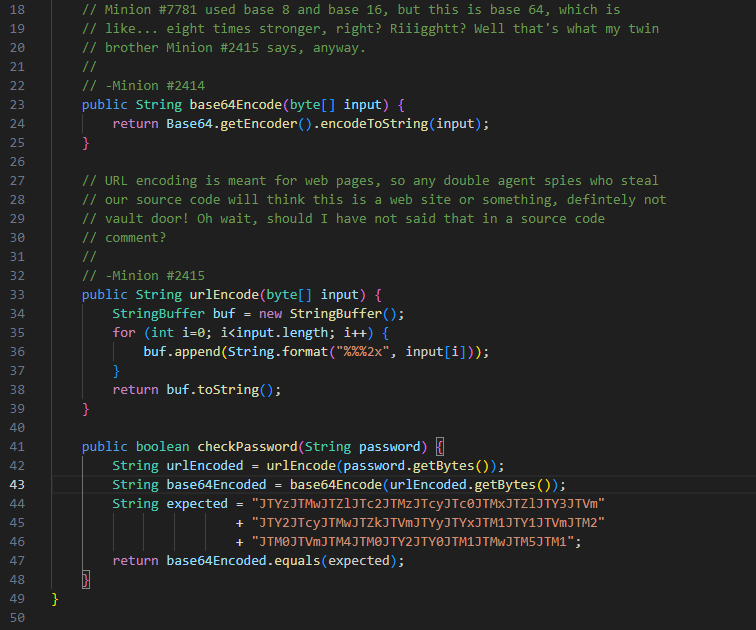
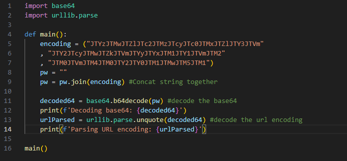
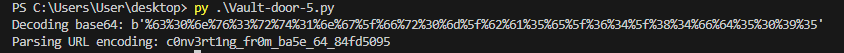
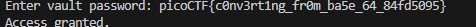

# Vault Door 5
*This is a continuation on the Vault Door Challenges*  

Oh no, it looks like the minions technologies have advanced AGAIN and we need to figure out what they've done with reverse engineering. It doesn't look like the base code has changed. Lets take a look shall we?

### Base Code

### checkPassword

 

It looks like they're are using a new type of encoding. Specifically they are using Base64 and Url encoding. There is one rule about encoding that will make this easy for us. Anything encoded one way is decoded the same way in reverse, and the results are always the same. Luckily, we can see what the expected result of the string is. Lets use it and work backwards to decode. I have made another python script to make this easier. 
 

 
We're going to take advantage of the *base64* and *urllib* modules to decode their password. Since we are going in reverse, we should decode their base64 encoding first since that is what they did last. Afterwards, we will decode their url encoding which should leave us with their password. Lets give the script a try.
 

 
Abrakadabra, the magic has been dispelled and it looks like it worked. The new password is **c0nv3rt1ng_fr0m_ba5e_64_84fd5095**. Lets try it in the `picoCTF{}` format. The password should be **picoCTF{c0nv3rt1ng_fr0m_ba5e_64_84fd5095}**.  

 
Success!