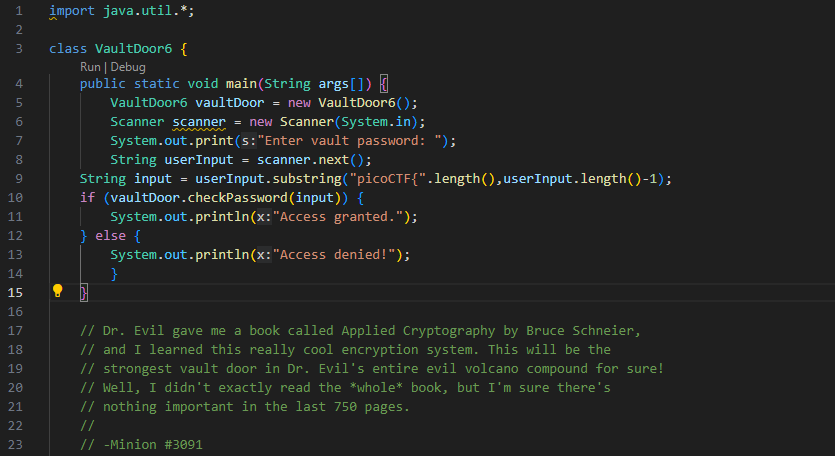
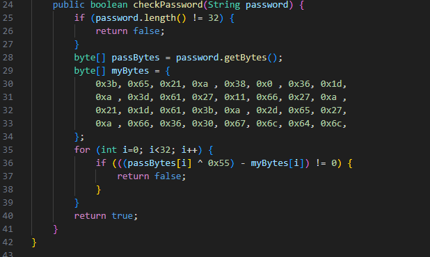
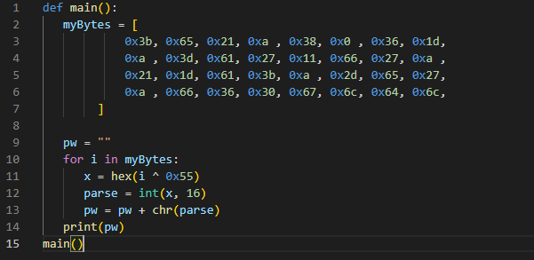
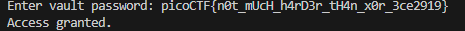

# Vault Door 6
*This is a continuation on the Vault Door Challenges*  

Its the MINIONS! They're back again! This time they've got a XOR encryption scheme. It looks like the base code is the same as always. Lets take a look at what we've got on our hands this time.

### Base Code

### checkPassword

  

It looks like the algorithm now uses `(byte XOR 0x55) - myBytes`. First, we need to understand how XOR works.

## XOR

  

This is a XOR Table. It tells us the result of comparing 2 bits to each other with XOR. As we can see 0 compared to 0 will give us 0, and 1 compared to 1 will give us 0. The easiest way to think of this is that if the two inputs are the same then it is a 0 and if they are different then it is a 1.
  

When we XOR hexdecimals numbers, we need to convert them back to binary in order to XOR since it is a bitwise operator. It only looks at 1 bit position at a time. We will take the first iteration of this problem as an example.   

### XOR operation example
Our first byte from our data structure is `0x3b`. We also have `0x55` from the algorithm. Lets convert both of these to binary.  

    0x3b = 00111011
    0x55 = 01010101

Now when we compare these values to each other with XOR, we will look at one position at a time from left to right. The notation of XOR is denoted by ^ (this is not an exponent sign). Our comparison should look something like:

    1. 0 ^ 0 = 0 (0 XOR 0)
    2. 0 ^ 1 = 1 (0 XOR 1)
    3. 1 ^ 0 = 1 (1 XOR 0)

Comparing `0x3b` to `0x55` will look like:  

    00111011 (0x3b)
    01010101 (0x55)
    ----------
    01101110 (0x6e)

One important property of XOR is that it can be reversed. What I mean by that is that 

    X ^ Y = Z and 
    Z ^ Y = X

To prove it we can do it on our results:

    01101110 (0x6e)
    01010101 (0x55)
    ---------
    00111011 (0x3b)

This will come very useful for solving the password.

## Solution

  

Now that we know how XOR works, we can make a program to iterate through all of the bytes they used. Using the properties of XOR, we can find the hex that was in `passBytes[i]` by doing `i ^ 0x55`. Afterwards, we can parse it into a hex value and find the character that was inputted by the user. Once the loops are done, it will have appended all the characters into a string giving us the password **n0t_mUcH_h4rD3r_tH4n_x0r_3ce2919**. Lets test the password out in the usual format.  

  

Success!