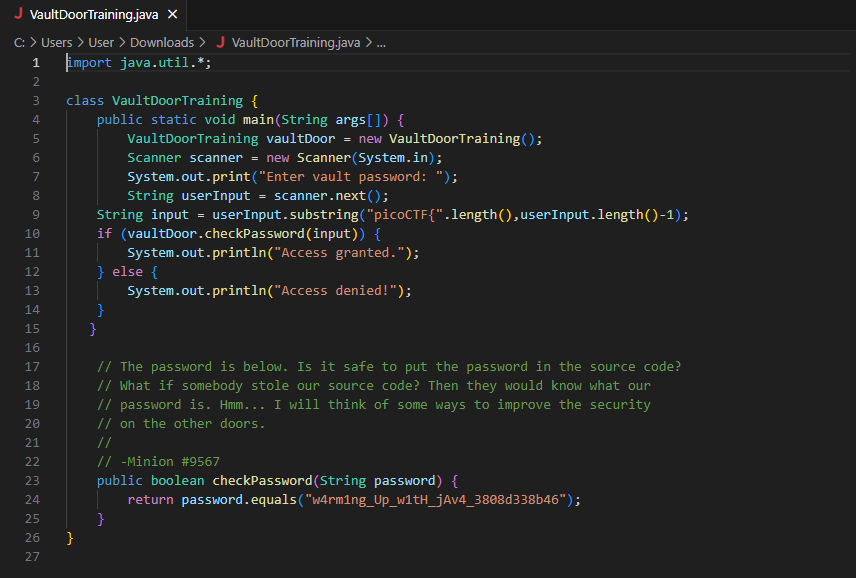
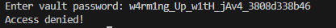
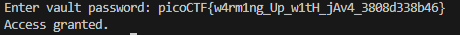

# Vault Door Training
In this challenge, we review some Java code.

Let's break the code down and see what it is doing exactly:
1. Line 5 - 8: The program is looking for an input for the user.
2. Line 9: A substring of the user input starting from the end of picoCTF{ and the character before the last is saved into a string
3. Line 10 - 15: The checkPassword function is called to determine if the password matches
4. Line 23 - 26: checkPassword returns a bool and it is true if the password matches w4rm1ng_Up_w1tH_jAv4_3808d338b46
---
Now that we know what the code is doing, we can see that the password is in the clear which is **w4rm1ng_Up_w1tH_jAv4_3808d338b46**. Let's enter it to try and gain access.

Huh? I thought that was the password. The minion even said the password is below. Why am I getting "Access Denied"? 

To find the answer to this, we have to take a clear inspection of line 9:   
`String input = userInput.substring("picoCTF{".length(),userInput.length()-1)`   
Notice that the input starts from after `picoCTF{` and before the last character in the string. This means if we enter 
w4rm1ng_Up_w1tH_jAv4_3808d338b46
, the program will store 
p_w1tH_jAv4_3808d338b4
instead and we know they don't match. This must mean the password is in some format of 
picoCTF{xyz}
. Let's try 
picoCTF{w4rm1ng_Up_w1tH_jAv4_3808d338b46}.

Success!
