# Agent Sudo

The objective of this challenge is to find the flag and answer the questions. You can try the challenge for yourself [here](https://tryhackme.com/room/agentsudoctf)

#### How many open ports?

To find open ports, we can use ``nmap`` to find them.

    Answer: 3

#### How do you redirect yourself to a secret page?

When visiting the address in our browser, we are greeted with a message informing us on how to reach other webpages.

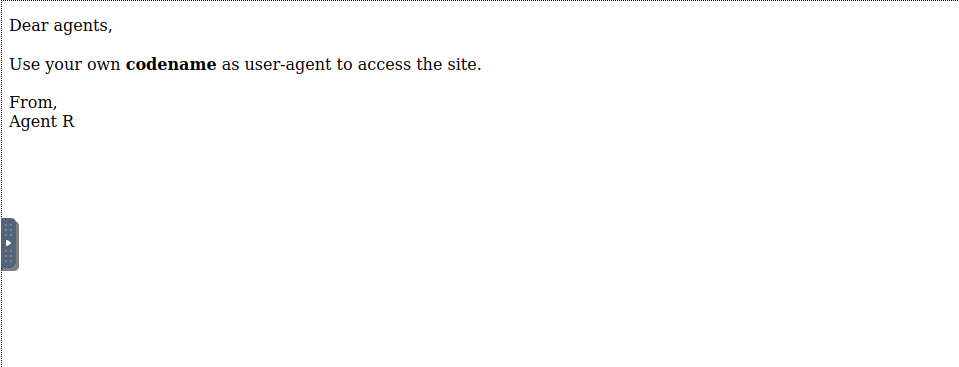

The user-agent is a header attribute in web requests. In order to modify it, we will need to intercept the request. This is when Burpe Suite comes in handy.

    Answer: user-agent

#### What is the agent's name?

The only codename we know so far is R for Agent R. We can try their page.

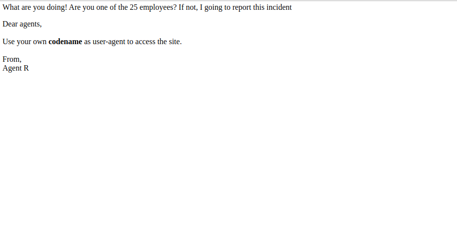

If there are 25 employees, then we can assume all of the other agents are also alphabet letters. Trying out other letters in the user-agent, Agent C seems to have a page.

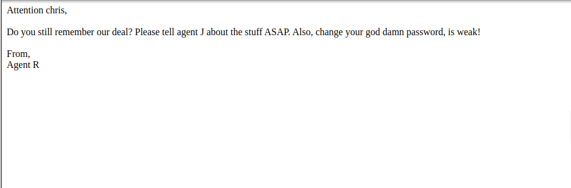

    Answer: Chris

#### What is the FTP Password?

Now that we know the agent's name is chris, we can check whether that is his username. Using Hydra, we can try to crack chris's password with the ``rockyou.txt`` wordlist since they have a week password.

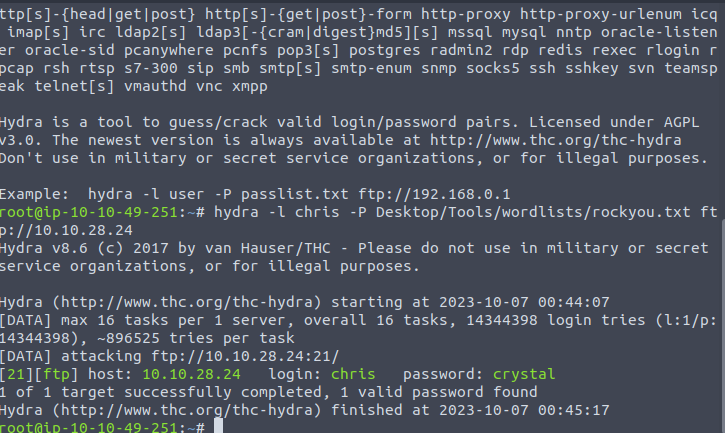

Doing so will show that Hydra found the password ``crystal``.

    Answer: crystal

#### What is the Zip password?

Entering the account using ftp will show 3 files. Using ``mget`` will allow us to download all of them.

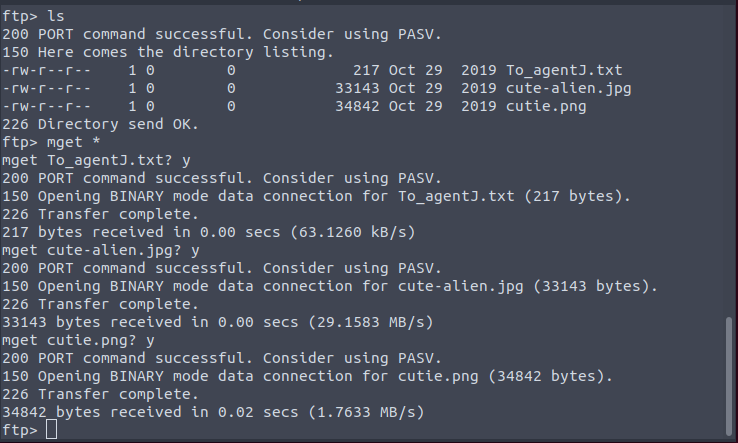

Looking at the message will say that there is something hidden in the images. We can start by using ``strings`` to see if there is anything readable inside the images. Using ``strings`` on cutie.png will show there is a couple txt files hidden inside of it.

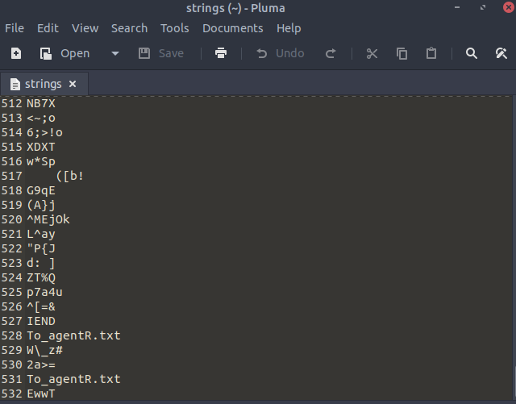

To get these files out, we can use ``binwalk``. Binwalk allows compressed data in a file to extracted out. Using binwalk on cutie.png will extract a zip file out.

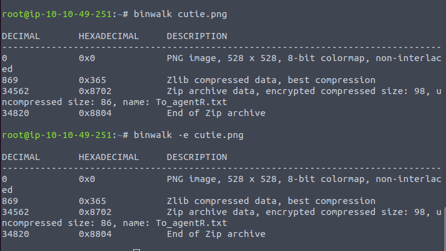

Now we need to use ``zip2john`` to allow John the Ripper be able to try and crack the password. Storing the results of ``zip2john`` into a text file and using it as the target for John along with the `rockyou.txt` wordlist will give the password ``alien`` for the zip file.

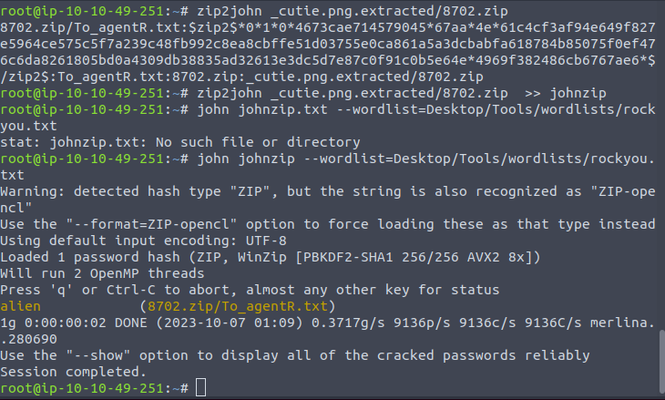

    Answer: alien

#### Who is the steg password?

Opening the text file inside the zip folder will show an encoded string. We can take this to any Base 64 decoder and it should show the result of ``alien``.

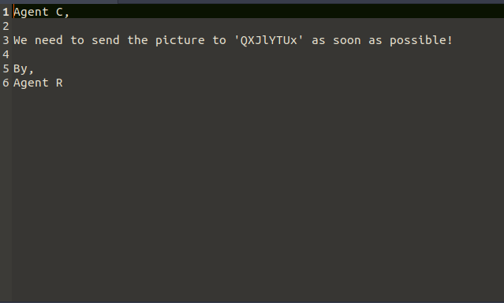

    Answer: alien

#### Who is the other agent?

This part was pretty confusing and took me a moment. It turns out that there is something hidden in cute-alien.png image and in order to extract it you should use the ``steghide`` command. When using the command, you will need to provide the steg password.

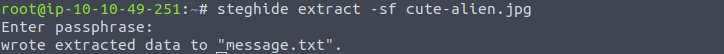

The command should extract a ``message.txt`` file. This file reveals the password and name for Agent J.

    Answer: James

#### What is the SSH Password?

    Answer: hackerrules!

#### What is the user flag?

We should be able to enter James' account through SSH now using the credientials we found. In their account, you will find a flag file and an Alien autopsy image.

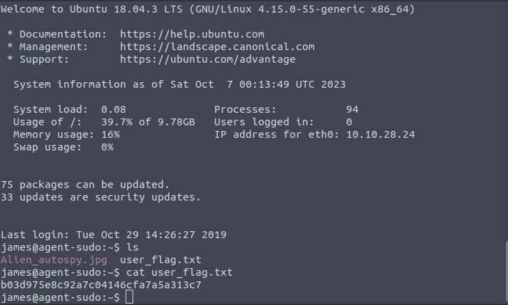

    Answer: b03d975e8c92a7c04146cfa7a5a313c7

#### What is the incidnt of the photo called?

Copying the file to your pc and uploading it to google images will show you that the photo is about Roswell alient autopsy.

    Answer: Roswell alien autopsy

#### What is the CVE number for this escalation?

This one also took a little while to figure out. If you try to take a glance at the text file in the root folder, you will notice James' account does not have the permssions to do so. The best option here is to look at what permissions they do have by using the ``sudo -l`` command. This shows that this account only has the permission ``(ALL, !root) /bin/bash`` and putting that in Google will give a page about an exploit.

[https://www.exploit-db.com/exploits/47502](./https://www.exploit-db.com/exploits/47502)

Checking the page shows the CVE number.

    Answer: CVE-2019-14287

#### What is the root flag?

Following the instructions on the webpage will give us access to the root account. This means the root.txt file is accessible now and looking at its contents shows the root flag.

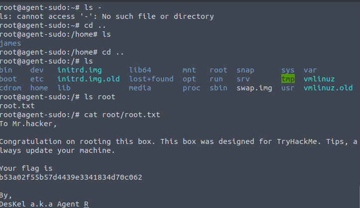

    Answer: b53a02f55b57d4439e3341834d70c062