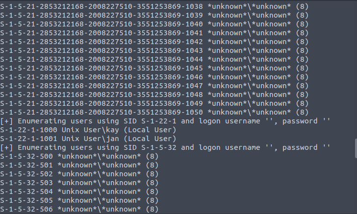

# Basic PenTesting

This activity lists a series of questions to find the answer to. You can try the activity for yourself [here](https://tryhackme.com/room/basicpentestingjt#).

### 1. Find the services exposed by the machine

In a black box scenario for Penetration Testing, our first objective is to do reconaissance. After checking our connectivity with ``ping``, we can use the amazing tool named ``Nmap``. It allows us to port scan the address to see what services are running.

We can see that there is a web server running on port 80. Let's try to connect to it through the browser.

### 2. What is the name of the hidden directory on the web server?

Dirb is a web content scanner that is used to find hidden objects and directories. We can use this tool to find what other directories are hidden.

As you can see, Dirb has found a /Development directory through its scan.

    Answer: Development

### 3. User brute-forcing to find the username & password

#### What is the username?

A great tool to use for enumeration is called `enum4linux`. It is capable of detecting and extracting data from Windows and Linux operation systems. Here, it can be used to discover users from the server. 

We can see that there are 2 users, Jan and Kay. The website is specifically asking for Jan.

    Answer: Jan

#### What is the password?

Hydra is a password cracking tool that can either use a wordlist or bruteforce to attempt many different password. In this scenario, we'll want to use one of the wordlists provided on the machine since it is stated to be a weak credential if you visit the development page notes.

The wordlist we'll use here is ``Rockyou.txt``.

It seems like a password was found and it is armando.

    Answer: armando

#### What is the name of the user you found?

This would be kay.

    Answer: kay

### 4. What is the final password you obtain?

If you have connected with jan's account and traversed the directories, you should know that kay's files are accessible. You will see a ``pass.bak`` file that contains the final password but we do not have permission to read it. Only kay has this permission. We need to find a way to logon as kay. 

Fistly, we can see that kay's ``id_rsa`` file is readable. copy the key in kay's by using jan's account and create a new file with copied information. Change the permission to read and write. If we don't change the permission then it will give a ``bad permissions``
warning. 

Secondly, we need to use John the Ripper (JtR) to find the password for kay's account. JtR has a feature called SSH2John to convert key files into a txt format to try and brute force. We can apply the ``Rockyou.txt`` wordlist onto the txt file afterwards to find the password.

Lastly, we need access kay through ssh to get the password.

    Answer: heresareallystrongpasswordthatfollowsthepasswordpolicy$$

