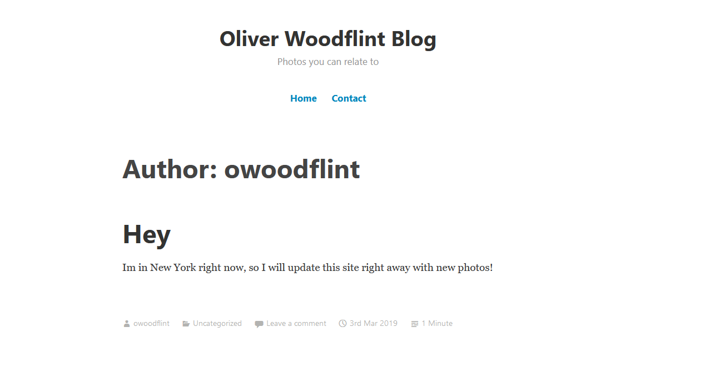

# OhSint

You can try this challenge [here](https://tryhackme.com/room/ohsint)

Downloading the image will give you an image of the default Windows XP Background but there is more to it. This activitiy consists of 7 questions to answer. 

### 1. What is this user's avatar of?

Using exiftool on the image provided will analyze its metadata. The important attribute here is the Copyright.

We can see here that the owner of this image is someone named OWoodFlint. Google searching their name will yield a Twitter page with the avatar of a cat.

    Answer: Cat

2. What city is this person in?

Taking the BSSID from the Twitter post and applying to a ``Wigle.net`` search will inform you that the person is from London.

    Answer: London

3. What is the SSID of the WAP he connected to?

Taking a glance at the `Wigle` search again, it will show that the SSID is UnlieverWiFi

    Answer: UnlieverWifi

4. What is his personal email address?

There are 2 other pages related to OWoodFlint, a GitHub and a WordPress page. Let's take a look at the GitHub Page.

It looks like the email is in plain sight.

    Answer: OWoodFlint@gmail.com

5. What site did you find their email address on?

    Answer: GitHub

6. Where has he gone on holiday?

Let's take a look at their last webpage, the WordPress Page. It looks like they mentioned that they are on vacation in New York.

    Answer: New York

7. What is the person's password?

Lastly, lets take a look at the source code.

It looks like there is some white colored text to hide with the white background. 

    Answer: pennYDr0pper.!