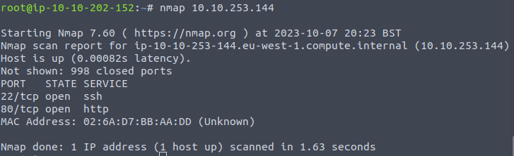
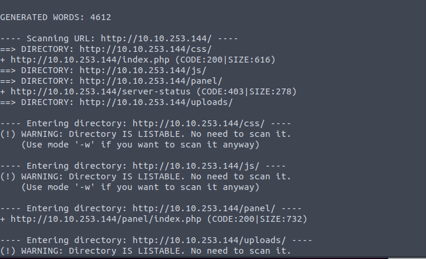
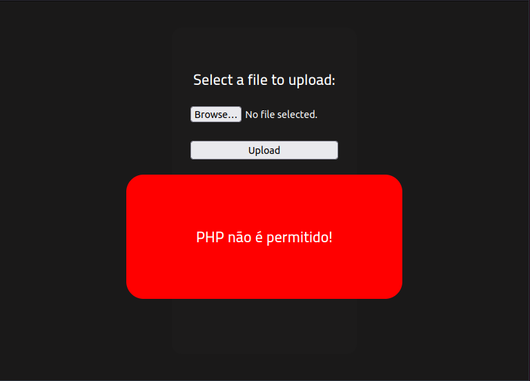
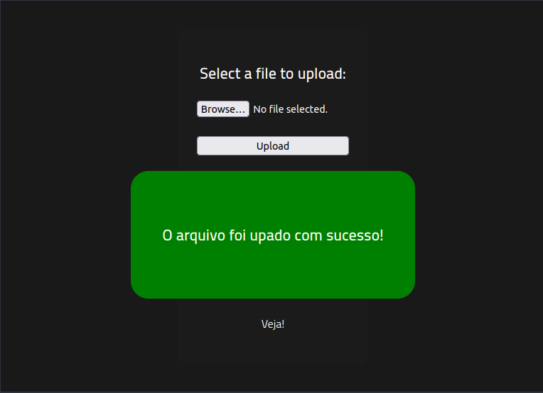
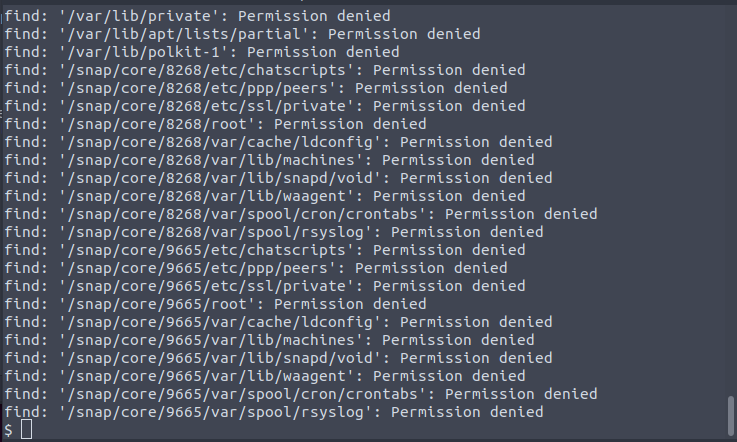
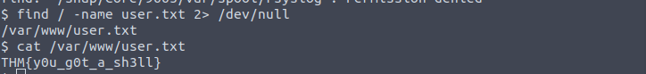
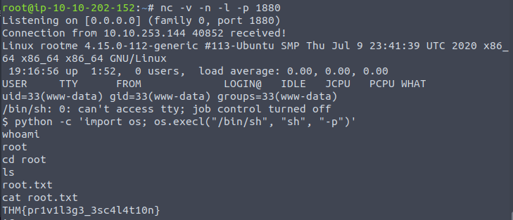

# RootMe

The goal of this challenge is to connect a reverse shell and conduct privilege escalation in order to get the root flag. You can try the challenge [here](https://tryhackme.com/room/rrootme)

#### How many ports are open?

The first objective is to conduct reconnaisance. Without knowing anything, the initial approach would be to do a port scan. This can be done using ``Nmap``.

    nmap [options] <IP_ADDRESS>

It shows that there are 2 open ports, 22 and 80.

    Answer: 2

#### What version of the Apache is running?

``Nmap`` has additional features to check for OS and service versions when scanning a webpage. This feature will show what version of Apache is running. If you want all information, the ``-A`` flag can be executed.

    Answer: 2.4.29

#### What service is running on port 22?

By default, port 22 runs the SSH service. This can be changed through server configuration.

    Answer: SSH

#### What is the hidden directory?

Gobuster, dirb, and dirbuster and all tools that are used to find hidden directories for a host. In this case, I will be using dirb.

    dirb http://<IP_ADDRESS>

#### What is the flag in the user.txt file?

Starting off, we need to visit the hidden directory to see what is on that page.

    http://<IP_ADDRESS>/panel

You'll find a page that allows image uploads. The upload system will be exploited for reverse shell.

If this is your first time doing this it can be a little tricky. It was for me. Looking at the hint, it tells the user to research on ``File Extension Bypasses`` and ``PHP Reverse Shell``. Googling these will lead to 3 important links which I will include down below.

1. [File upload bypass- Hacker's Grimoire](https://vulp3cula.gitbook.io/hackers-grimoire/exploitation/web-application/file-upload-bypass)

2. [PHP reverse shell source code](https://github.com/pentestmonkey/php-reverse-shell)

3. [How to use PHP reverse shell](https://pentestmonkey.net/tools/web-shells/php-reverse-shell)

The important things to do are to read how file upload bypass works and the instructions on how to use the reverse shell code. After doing so, the IP and port should be changed on the code and the file extension should be changed. Also, there should be a netcat on standby to receive transmission. Trying to upload the PHP file without changing it's extension will not be permitted.

Since this is a PHP file we are trying to upload, we can try every PHP extension out. It so happens that ``.phtml`` works and runs the code.

The goal was to find the flag in user.txt. Now that we have access to the system, we need to find this file. This can be done using the ``find`` command.

    find / -name user.txt

This creates a lot of noise so, lets make it clearer.

    find / -name user.txt 2> /dev/null

Doing so, we'll see only one directory that contains user.txt. Written in it is the flag.

    Answer: THM{y0u_g0t_a_sh3ll}

#### What is the flag in root.txt?

The next objective is to conduct privilege escalation since accessing `/root/root.txt` requires root privileges. The challenge gives us some hints.

Firstly, we need to know which directories have SUID permissions. This can be done using ``find``.

    find / -perm /4000 2> /dev/null

Scrolling through the results should show that ``Python`` has SUID permissions. 

Secondly, our next hint suggests to research on GTFObins which should lead to a [github page on GTFOBins](https://gtfobins.github.io/). Based on our previous activities, it should be clear to go to what they have on Python and SUID.  Run the command demonstrated and use ``whoami`` to check whether you are the root user.

    python -c 'import os; os.execl("/bin/sh", "sh", "-p")'
    whoami

It should respond with ``root``. Now we just need to access the file.

    Answer: THM{pr1v1l3g3_3sc4l4t10n}
